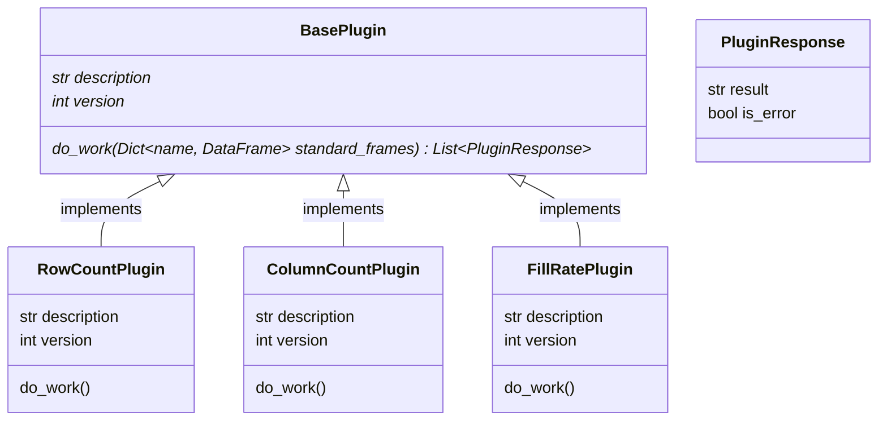

# python-pseudo-plugins
Dynamically load Python classes in a plugin-type manner.

# Background
If:
* We have an application which needs to offer extensible functionality
* We accept that extensions (or plugins) can be written in code
* The extensions all follow a similar execution pattern (same inputs, same entry-point, etc.)

then we can use some trickery to dynamically load Python classes which inherit from an abstract base plugin:


The plugin implementations can be loaded from an entirely different package, which gives more flexibility for removing other contributors access from the main codebase.

# Requirements
Python `>=3.7.13` (untested on anything lower).

# Sample Code Instructions

1. Install the `main_app` and `plugins` packages. (i.e. `pip install -e src/main_app/`)
2. Run `main.py` from the repo root to see the loading in action.

Plugins will be dynamically loaded and an output like this provided:
```
Loading Plugins
Loaded Plugins:
ColumnCountPlugin v0 - Column counter. File:column_count
FillRatePlugin v0 - Fill rate calculator. File:fill_rate
RowCountPlugin v0 - Row counter. File:row_count

Initializing plugins

Executing plugins

Results:
[ColumnCountPlugin] [NORMAL] fixed_nums is 3 columns wide
[ColumnCountPlugin] [NORMAL] random_nums is 3 columns wide
[ColumnCountPlugin] [NORMAL] ragged_nums is 3 columns wide
[FillRatePlugin] [NORMAL] A in fixed_nums has a fill rate of 100.0%
[FillRatePlugin] [NORMAL] B in fixed_nums has a fill rate of 100.0%
[FillRatePlugin] [NORMAL] C in fixed_nums has a fill rate of 100.0%
[FillRatePlugin] [NORMAL] A in random_nums has a fill rate of 100.0%
[FillRatePlugin] [NORMAL] B in random_nums has a fill rate of 100.0%
[FillRatePlugin] [NORMAL] C in random_nums has a fill rate of 100.0%
[FillRatePlugin] [ERROR] A in ragged_nums has a fill rate of 83.33%
[FillRatePlugin] [ERROR] B in ragged_nums has a fill rate of 83.33%
[FillRatePlugin] [ERROR] C in ragged_nums has a fill rate of 50.0%
[RowCountPlugin] [NORMAL] fixed_nums is 6 rows long
[RowCountPlugin] [NORMAL] random_nums is 10 rows long
[RowCountPlugin] [NORMAL] ragged_nums is 6 rows long

Process finished with exit code 0
```