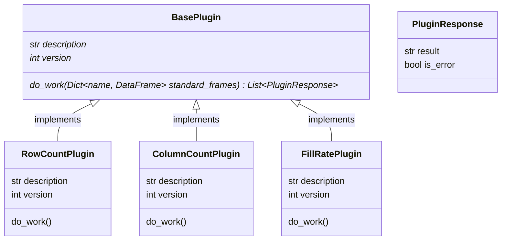

# python-pseudo-plugins
Dynamically load Python classes in a plugin-type manner.

# Background
If:
* We have an application which needs to offer extensible functionality
* We accept that extensions (or plugins) can be written in code
* The extensions all follow a similar execution pattern (same inputs, same entry-point, etc.)

then we can use some trickery to dynamically load Python classes which inherit from an abstract base plugin:

The plugin implementations can be loaded from an entirely different package, which gives more flexibility for removing other contributors access from the main codebase.

# Requirements
Python `>=3.7.13` (untested on anything lower).

# Sample Code Instructions

1. Install the `main_app` and `plugins` packages. (i.e. `pip install -e src/main_app/`)
2. Run `main.py` from the repo root to see the loading in action.